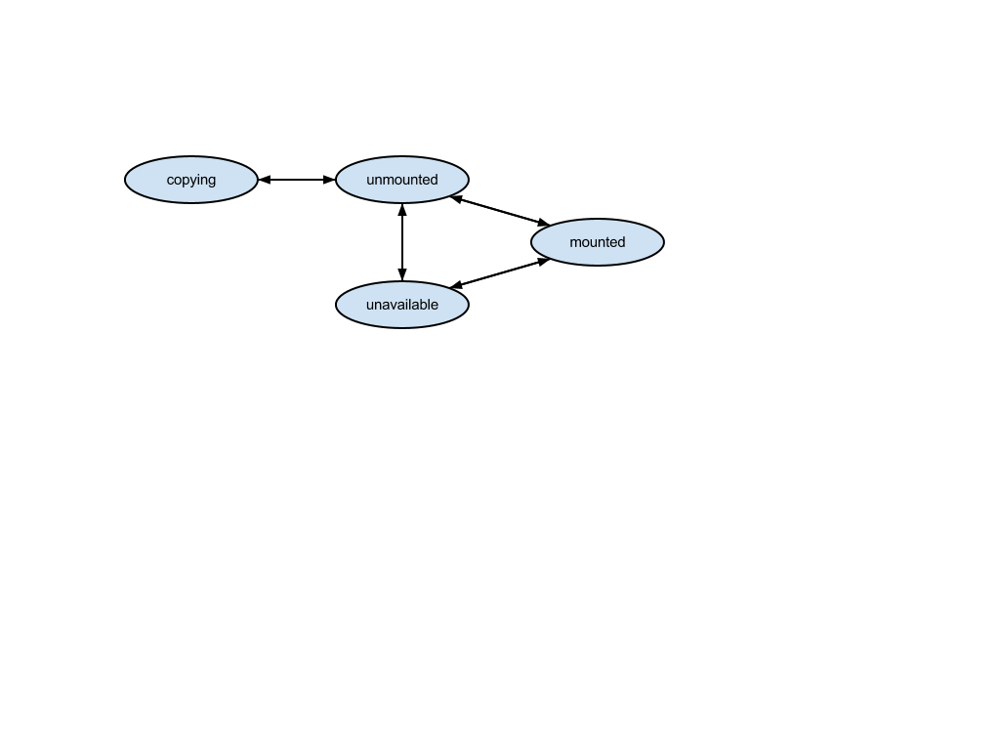

Drives
======

Allowed HTTP methods
--------------------

+--------+--------------------------+
| Method | Description              |
+========+==========================+
| GET    | get / list object/s      |
+--------+--------------------------+
| POST   | create new object/s      |
+--------+--------------------------+
| PUT    | update / modify object/s |
+--------+--------------------------+
| DELETE | delete object/s          |
+--------+--------------------------+

.. note::

    See :rfc:`2616#section-9` for more details on HTTP methods semantics

Listing
-------

.. http:get:: /drives/

    Gets the list of drives to which the authenticated user has access.

    :param fields: A set of field names specifying the returned fields
    :statuscode 200: no error

    **Example request 1 - default list**:

    .. literalinclude:: dumps/request_drive_list
        :language: javascript

    **Example response 1 - default list**:

    .. literalinclude:: dumps/response_drive_list
        :language: javascript

    **Example request 2 - just uuid and status fields**:

    .. literalinclude:: dumps/request_drive_list_just_uuid_and_status
        :language: javascript

    **Example response 2 - just uuid and status fields**:

    .. literalinclude:: dumps/response_drive_list_just_uuid_and_status
        :language: javascript

Detailed listing
----------------

.. http:get:: /drives/detail/

    Gets the detailed list of drives with additional information to which the authenticated user has access.
   
    :statuscode 200: no error

    **Example request**:

    .. literalinclude:: dumps/request_drive_list_detail
        :language: javascript

    **Example response**:

    .. literalinclude:: dumps/response_drive_list_detail
        :language: javascript

List single drive
-----------------

.. http:get:: /drives/{uuid}/

    Gets detailed information for drive identified by `drive_uuid`.

    :statuscode 200: no error

    **Example request**:

    .. literalinclude:: dumps/request_drive_get_unmounted
        :language: javascript

    **Example response**:

    .. literalinclude:: dumps/response_drive_get_unmounted
        :language: javascript

Creating
--------

.. http:post:: /drives/

    Creates a new drive or multiple drives.

    :statuscode 201: object created

    **Example request**:

    Create a drive

    .. includejson:: dumps/request_drive_create_bulk
        :accessor: objects.0

    or create multiple drives

    .. includejson:: dumps/request_drive_create_bulk

    or you can omit the {'objects': ... } and provide only the list:

    .. includejson:: dumps/request_drive_create_bulk
        :accessor: objects

    **Example response**

    .. literalinclude:: dumps/response_drive_create_bulk
        :language: javascript

.. _drive-edit:

Editing
-------

.. http:put:: /drives/{uuid}/

    Edits a drive. Note that if the drive is mounted on a running server only the ``name``, ``meta``, ``tags``, and
    ``allow_multimount`` can be changed. If other fields such as ``size`` or ``media`` are changed for a drive mounted
    on a running server these changes will be ignored. To make sure that the changes are either fully applied or an
    error is returned if impossible, use the resize action (:ref:`drive-resize`). Note that changing drive size might
    be a slow operation, and the drive cannot be used during the resizing.

    :statuscode 200: no errors

    **Example request**:

    .. literalinclude:: dumps/request_drive_edit
        :language: javascript

    **Example response**:

    .. literalinclude:: dumps/response_drive_edit
        :language: javascript

.. _drive-resize:

Resizing (Update or Fail)
---------------------------

.. http:post:: /drives/{uuid}/action/?do=resize

In order to make sure that drive changes take effect, one can use the resize action. It updates a drive definition,
and returns an error if not possible to completely apply the new drive definition, which may happen if the drive is
mounted on a running server. The name of the action is ``resize`` because only drive size cannot be changed for a drive
mounted on a running server.

Note that the resize action is a full definition update (it can update even name and meta), so a full definition
should be provided to this call.

**Example:**

.. literalinclude:: dumps/request_drive_resize_action
    :language: javascript

Note that the drive in the response is with status resizing:

.. literalinclude:: dumps/response_drive_resize_action
    :language: javascript

Meta
-----

It is possible to add arbitrary key-value data to a drive definition. See :doc:`meta` for more information.

Deleting
--------

Single drive
~~~~~~~~~~~~

.. http:delete:: /drives/{uuid}/

    Deletes a single mounted or unmounted drive.

    :statuscode 204: No content, object deletion started.

    **Example request**:

    .. literalinclude:: dumps/request_drive_delete
        :language: javascript

    **Example response**:
   
    .. literalinclude:: dumps/response_drive_delete
        :language: javascript

Multiple drives
~~~~~~~~~~~~~~~

.. http:delete:: /drives/

   Deletes multiple mounted or unmounted drives specified by their UUID's.

      :statuscode 204: No content, object deletion started.

   **Example request**:

   Request body

   .. parsed-literal::

      {"objects":
        [
          {
           "uuid":"b137e217-42b6-4ecf-8575-d72efc2d3dbd",
          },
          {
           "uuid":"e035a488-8587-4a15-ab25-9b7343236bc9",
          },
          {
           "uuid":"feded33c-106f-49fa-a1c4-be5c718ad1b5",
          }
        ]
      }

   **Example response**:
   
   .. sourcecode:: http
   
      HTTP/1.0 204 NO CONTENT
   
.. _drive_cloning:

Cloning
-------

.. http:post:: /drives/{uuid}/action/?do=clone

    Clones a drive. Request body is optional and any or all of the key/value
    pairs can be omitted.

    :statuscode 202: Action accepted, execution is proceeding.

    **Example request**:

    .. literalinclude:: dumps/request_drive_clone
        :language: javascript

    **Example response**:

    .. literalinclude:: dumps/response_drive_clone
        :language: javascript

.. note::

    The name of the cloned drive will be changed using the clone naming strategy set in the profile.
    See :doc:`clone_naming` for more information 

Request schema
~~~~~~~~~~~~~~

   .. parsed-literal::

      {
         "description":"Clone drive",
         "properties":{
         	"name":{
         		"description": "Name of the cloned drive",
         	}
         	"media":{
         		"description": "Media of the cloned drive",
         	}
         	"affinities":{
         		"description": "Affinities of the cloned drive",
         	}
         }
      }

Availability Groups
-------------------

It is possible to query which drives share common storage hosts. See :ref:`drive-availability`.

Creating or Cloning Drives to Different Infrastructure (avoid)
---------------------------------------------------------------

It is possible to hint the system which drives are preferred to be on separate physical storage host.
See :ref:`drives-avoid`.

Licenses
--------

Drives can have licenses attached to them. This means usage of the given drive on a running server requires either 
posession of subscriptions for the given licenses or additional payment. Typical such example are some drives in the drives library, 
see :ref:`libdrives-licensed` and :ref:`billing-license` 

.. _storage_type:

Storage Types
-------------

Every drive has a ``storage_type`` on which they live and cannot be changed after creation. New drives by default go to
``dssd``, and :ref:`clones <drive_cloning>` go to the same medium as their origin, but this can be overriden by passing
a ``storage_type`` parameter. Allowed storage types can be different per location, so you should refer to the **drives**
section of the :doc:`capabilities <capabilities>` call response, where each storage type is specified alongside with
the minimum and maximum size of a single drive.

    .. versionadded:: Neon

Creating
~~~~~~~~

    **Example request**:

    .. literalinclude:: dumps/request_drive_create_zadara
        :language: javascript

    **Example response**:

    .. literalinclude:: dumps/response_drive_create_zadara
        :language: javascript

Cloning to the same storage type
~~~~~~~~~~~~~~~~~~~~~~~~~~~~~~~

    **Example request**:

    .. literalinclude:: dumps/request_drive_clone_zadara_zadara
        :language: javascript

    **Example response**:

    .. literalinclude:: dumps/response_drive_clone_zadara_zadara
        :language: javascript

Cloning to another storage type
~~~~~~~~~~~~~~~~~~~~~~~~~~~~~~~

    **Example request**:

    .. literalinclude:: dumps/request_drive_clone_dssd_zadara
        :language: javascript

    **Example response**:

    .. literalinclude:: dumps/response_drive_clone_dssd_zadara
        :language: javascript

Drive State Diagram
-------------------

Schema
------

   .. literalinclude:: dumps/response_drive_schema
        :language: javascript
