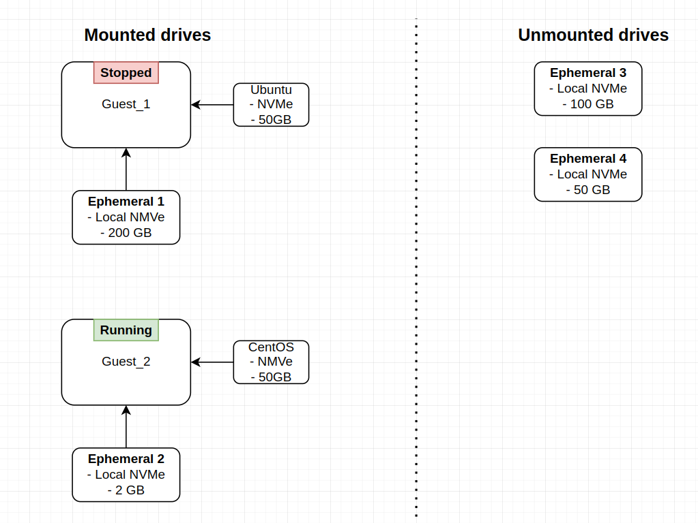
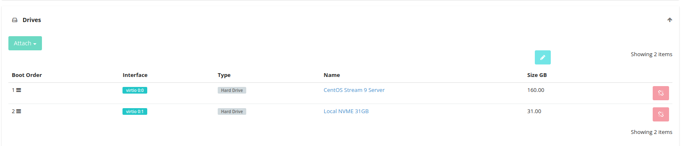

Ephemeral drives
================
Ephemeral drives are physically attached to the compute host. Because they are local
and not network-attached, they offer low latency and high throughput, making them ideal
for workloads that require maximum performance. However, the storage is ephemeral, data
is lost if the guest is stopped, so ephemeral drives are best suited for
temporary data or caches rather than persistent storage.

API calls
~~~~~~~~~~~~~~~
Ephemeral drives are managed through the :doc:`drives` API calls,
which allow you to create, attach, detach, and delete these drives as needed.

========================  =======
Action                    Allowed
========================  =======
Create                    Yes
Delete                    Yes
Update                    Yes
Attach                    Yes
Resize                    Yes
Clone                     No
Download                  No
Upload                    No
Create Snapshot           No
Create Remote Snapshot    No
========================  =======

Resizing
~~~~~~~~~~~~~~~~~~~~~~~~~

.. http:post:: /drives/{uuid}/action/?do=resize

Note that the resize action is a full definition update (it can update even name and metadata), so a full definition
should be provided to this call.

Resize Checks and Conditions
----------------------------

- Resize is permitted only when the drive is in an **active** state
  (``MOUNTED`` or ``UNMOUNTED``) or in a ``STAGING`` state.
- The new size must be within the minimum and maximum limits specified by the :doc:`capabilities` API call.
- The system verifies that the resized ephemeral drive can fit within the
  existing available space in the cloud.

**Example:**

.. literalinclude:: dumps/request_ephemeral_drive_resize_action
    :language: http

Note that the drive in the response is with status resizing:

.. literalinclude:: dumps/response_drive_resize_action
    :language: javascript

Billing & Usage
~~~~~~~~~~~~~~~
Ephemeral drives are billed only when they are attached to running guests.
See the following example.

Local NVMe Billing Calculation
----------------------------------------
The following values show the total Local NVMe capacity allocated to the customer’s account
and the amount included in their subscriptions. The allocated capacity
represents the maximum Local NVMe space reserved for use, while the
subscription amount indicates the portion covered at no additional cost.

- **Local NVMe Allocated:** 352 GB — The total Local NVMe storage capacity assigned to the account.
- **Local NVMe Subscription:** 1 GB — The amount of Local NVMe usage included in the subscription
  without extra charges.

In this example, with 2 GB in use and 1 GB included in the subscription, the customer is billed
for 1 GB of Local NVMe usage.

Although 352 GB of Local NVMe is allocated, the billing system counts only the 2 GB actively
in use. Since the subscription includes 1 GB, charges apply only to the additional 1 GB of
usage beyond the subscription limit.

Guest configuration
~~~~~~~~~~~~~~~

Setup a guest with an OS drive(NVMe) and an ephemeral drive(Local NVMe).

Mount the Ephemeral Drive
~~~~~~~~~~~~~~~~~~~~~~~~~
To mount the ``vdb`` device, you’ll need to format it (if it hasn’t been formatted yet), create a mount
point, and then mount it.

1. Identify the Ephemeral Drive
-------------------------------
Before formatting, identify the correct device name for your ephemeral drive.
You can list available block devices using:

.. code-block:: bash

   lsblk

Look for a device that matches the expected size of your ephemeral drive
and is not yet mounted. In many cases, the device will appear as ``/dev/vdb``,
but this may vary.

2. Format the vdb Device
------------------------
For example, to format ``vdb`` with the ext4 filesystem:

.. code-block:: bash

   sudo mkfs.ext4 /dev/vdb

3. Create a Mount Point
-----------------------
Choose a directory where you want to mount the disk. Commonly, additional storage is mounted
under ``/mnt`` or ``/media``.

.. code-block:: bash

   sudo mkdir -p /mnt/ephemeral

4. Mount the vdb Device
-----------------------
Mount ``vdb`` to the directory you created:

.. code-block:: bash

   sudo mount /dev/vdb /mnt/ephemeral

5. Verify the Mount
-------------------
Use the ``lsblk`` or ``df -h`` command to confirm that ``vdb`` is mounted:

.. code-block:: bash

   lsblk
   df -h

To verify write access, create a small test file in the mounted directory:

.. code-block:: bash

   sudo touch /mnt/ephemeral/testfile

List the directory to confirm the file was created:

.. code-block:: bash

   ls -l /mnt/ephemeral

Once verified, you can remove the test file:

.. code-block:: bash

   sudo rm /mnt/ephemeral/testfile
