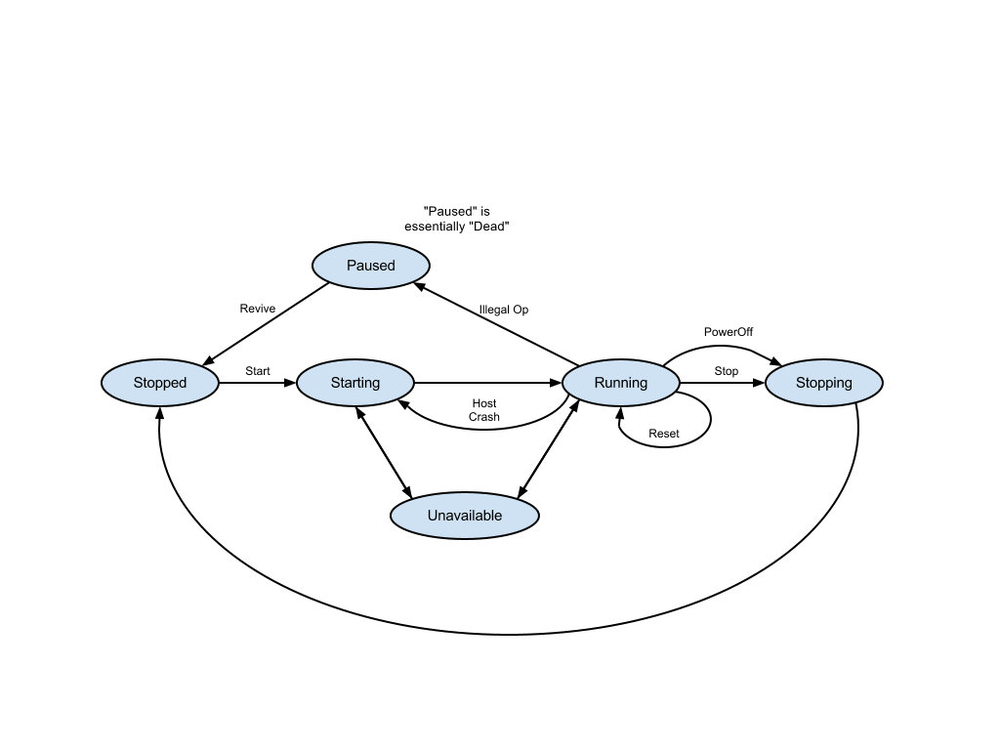

Servers / VMs
=============

Hypervisors
-----------

Servers have `hypervisor` and `cpu_type` :ref:`parameters <hypervisors>` whose combination must match the one in the
capabilities of the cloud. This page deals with generic server operations. There are specifics for each type of
hypervisor:

* :doc:`kvm <servers_kvm>`
* :doc:`solaris_kz <servers_solariskz>`

The default `hypervisor` is `kvm` to maintain backwards compatibility and the default `cpu_type` is `amd`. If you
specifiy a different `hypervisor` and no `cpu_type`, the API will still use `amd`.

Allowed HTTP methods
--------------------

+--------+--------------------------+
| Method | Description              |
+========+==========================+
| GET    | get / list object/s      |
+--------+--------------------------+
| POST   | create new object/s      |
+--------+--------------------------+
| PUT    | update / modify object/s |
+--------+--------------------------+
| DELETE | delete object/s          |
+--------+--------------------------+

.. note::

    See :rfc:`2616#section-9` for more details on HTTP methods semantics

Listing
-------

.. http:get:: /servers/

    Gets the list of servers to which the authenticated user has access.

    :statuscode 200: no error

    **Example request**:

    .. literalinclude:: dumps/request_server_list
        :language: http

    **Example response**:

    .. literalinclude:: dumps/response_server_list
        :language: javascript

Detailed listing
----------------

.. http:get:: /servers/detail/

    Gets the detailed list of servers to which the authenticated user has access.

    :statuscode 200: no error

    **Example request**:

    .. literalinclude:: dumps/request_server_list_detail
        :language: http

    **Example response**:

    .. literalinclude:: dumps/response_server_list_detail
        :language: javascript

.. _server_create:

Creating
--------

.. http:post:: /servers/

    Creates a new virtual server or multiple servers. The minimial amount of information you need to set is as follows

    :statuscode 201: object created

    **Example request**:

    .. literalinclude:: dumps/request_server_create_minimal
        :language: http

    **Example response**:

    .. literalinclude:: dumps/response_server_create_minimal
        :language: javascript

.. _server_edit:

Editing
-------

.. http:put:: /servers/{uuid}/

    Edits a server. Used also for attaching NICs and drives to servers. Note that if a server is running, only
    ``name``, ``meta``, and ``tags`` fields can be changed, and all other changes to the definition of a running server
    will be ignored.

    :statuscode 200: no error

    **Example request**:

    .. literalinclude:: dumps/request_server_edit_minimal
        :language: http

    **Example response**:

    .. literalinclude:: dumps/response_server_edit_minimal
        :language: javascript

.. _attach_drive:

Attach a drive
--------------

.. http:put:: /servers/{uuid}/

    Attaching a drive is just an :ref:`edit server <server_edit>` operation.

    :statuscode 200: no error

    **Example request**:

    .. literalinclude:: dumps/request_server_attach_drive
       :language: http

    **Example response**:

    .. literalinclude:: dumps/response_server_attach_drive
       :language: javascript

Metadata
--------

It is possible to add arbitrary key-value data to a server definition. See :doc:`meta` for more information.

Deleting
--------

Single server
~~~~~~~~~~~~~

.. http:delete:: /servers/{uuid}/

    Deletes a single server.

    :statuscode 204: No content, object deletion started.

    **Example request**:

    .. literalinclude:: dumps/request_server_delete
        :language: http

    **Example response**:

    .. literalinclude:: dumps/response_server_delete
        :language: javascript

.. _servers-delete-recursive:

Delete Server together with attached drives (recursive delete)
~~~~~~~~~~~~~~~~~~~~~~~~~~~~~~~~~~~~~~~~~~~~~~~~~~~~~~~~~~~~~~

.. http:delete:: /servers/{uuid}/?recurse={recurse_option}

It is possible to delete a server together with its drives (recursive delete). There are three options: delete all
attached drives, delete only disks(non-cdrom drives), or delete only attached cdroms. To recursively delete drives,
supply a ``recurse`` URL parameter with a value as described in the following table:

+----------------+----------------------------------------------------------------+
| Recurse option | Effect                                                         |
+================+================================================================+
| all_drives     | All attached drives regardless of media type will be deleted   |
+----------------+----------------------------------------------------------------+
| disks          | Only attached drives with media type ``disk`` will be deleted  |
+----------------+----------------------------------------------------------------+
| cdroms         | Only attached drives with media type ``cdrom`` will be deleted |
+----------------+----------------------------------------------------------------+

**Example request to delete a server with all attached drives**:

A server is created with a cdrom and disk drives:

.. literalinclude:: dumps/response_server_recurse_del_all_drives_create
    :language: javascript

The following drives are available in the account:

.. literalinclude:: dumps/response_server_recurse_del_all_drives_drives_before
    :language: javascript

The server is recursively deleted with all drives:

.. literalinclude:: dumps/request_server_recurse_del_all_drives_delete
    :language: http

After ``DELETE`` of the server the, drives attached to the server are deleted:

.. literalinclude:: dumps/response_server_recurse_del_all_drives_drives_after
    :language: javascript

**Example request to delete a server with attached disk drives and leave CDROMs**:

A server is created with a cdrom and disk drives:

.. literalinclude:: dumps/response_server_recurse_del_all_drives_create
    :language: javascript

The following drives are available in the account:

.. literalinclude:: dumps/response_server_recurse_del_disks_drives_before
    :language: javascript

The server is recursively deleted with all attached drives with media type ``disk``:

.. literalinclude:: dumps/request_server_recurse_del_disks_delete
    :language: http

After ``DELETE`` of the server, only drives with media type ``disk`` attached to the server are deleted. CDROMs are
left intact:

.. literalinclude:: dumps/response_server_recurse_del_disks_drives_after
    :language: javascript

.. _server-runtime:

Server Runtime and Server Details
---------------------------------

.. http:get:: /servers/{uuid}/

    Gets detailed information for server identified by `server_uuid`.

    :statuscode 200: no error

    If the server is started the definition includes a `runtime` attribute. The runtime object contains information on,
    when the server was started, and runtime information about the server NICs, such as how much traffic went through
    the interface and what are the dynamic IPs assigned to the NIC. The NIC runtime is also available in the NIC
    definition of the running server.

    **Example request**:

    .. literalinclude:: dumps/request_server_get_running
        :language: http

    **Example response**:

    .. literalinclude:: dumps/response_server_get_running
        :language: javascript

Server Actions
--------------

Start
~~~~~

.. http:post:: /servers/{uuid}/action/?do=start

    Starts a server with specific UUID.

    :statuscode 202: Action accepted, execution is proceeding.

    **Example request**:

    .. literalinclude:: dumps/request_server_start
        :language: http

    **Example response**:

    .. literalinclude:: dumps/response_server_start
        :language: javascript

.. warning::
    Servers have some default network restrictions, applied depending on your user state. Please refer to
    the :ref:`default restrictions <firewall_restrictions>` section the Firewall policies documentation

Stop
~~~~

.. http:post:: /servers/{uuid}/action/?do=stop

    Stops a server with specific UUID. This action is equivalent to pulling the power cord of a physical server. For
    more graceful shutdown see `ACPI Shutdown`_.

    :statuscode 202: Action accepted, execution is proceeding.

    **Example request**:

    .. literalinclude:: dumps/request_server_stop
        :language: http

    **Example response**:

    .. literalinclude:: dumps/response_server_stop
        :language: javascript

.. _acpi_shutdown:

ACPI Shutdown
~~~~~~~~~~~~~

.. http:post:: /servers/{uuid}/action/?do=shutdown

    Sends an ACPI shutdowns to a server with specific UUID for a minute. If the VM OS handles ACPI shutdown events
    (equivalent to pressing the power button), it will shutdown gracefully. As some operating systems don't always
    handle single ACPI event the shutdown is sent every second for a minute. While the shutdown is initiated, the
    server is put into status ``stopping`` to prevent interfering actions. If after a minute the server has not
    powered off during this minute the status is returned to ``running`` to allow the user to `Stop`_ it. If the
    server shuts down successfully during the one minute period it will be switched to ``stopped`` status.

    :statuscode 202: Action accepted, execution is proceeding.

    **Example request**:

    .. literalinclude:: dumps/request_server_acpi_shutdown
        :language: http

    **Example response**:

    .. literalinclude:: dumps/response_server_acpi_shutdown
        :language: javascript

Start in a separate availability group
~~~~~~~~~~~~~~~~~~~~~~~~~~~~~~~~~~~~~~

It is possible to hint the system which servers are preferred to run on separate hardware host.
See :ref:`servers-avoid`.

Open Serial Console Connection
~~~~~~~~~~~~~~~~~~~~~~~~~~~~~~

.. http:post:: /servers/{uuid}/action/?do=open_console

    Each server has a virtual serial device, which is tunneled to a TCP socket. The serial device is seen as /dev/ttyS0
    or COM1 on most operating systems. If your OS supports it, you can configure a serial console on this virtual
    serial port, which might be more conviniet to use than VNC, as it generally uses less bandwidth and allows you to
    copy-paste in the virtual terminal.

    :statuscode 202: Action accepted, execution is proceeding.

    **Example request**:

    .. literalinclude:: dumps/request_server_open_console
        :language: javascript

    **Example response**:

    .. literalinclude:: dumps/response_server_open_console
        :language: javascript

    The return object contains ``console_url`` formatted as csconsole://<cs-domain>:<port>.
    You can connect to it using telnet:

    .. sourcecode:: bash

        telnet direct.zrh.clousigma.com 12345

    Before being connected to the actual serial console, the server's ``vnc_password`` is required to prevent
    unauthorized access.

    Most telnet clients start in line mode, which usually interferes with standard unix shells and programs, so they
    need to be set to character mode. It is advisable to enter your password in line mode and then change to character
    mode. Refer to your telnet client manual. On some clients that is done by pressing ctrl+] (^]) and then entering
    "mode character" at the prompt.

Close Serial Console Connection
~~~~~~~~~~~~~~~~~~~~~~~~~~~~~~~

.. http:post:: /servers/{uuid}/action/?do=close_console

    Closes a VNC tunnel to a server with specific UUID.

    :statuscode 202: Action accepted, execution is proceeding.

    **Example request**:

    .. literalinclude:: dumps/request_server_close_console
        :language: javascript

    **Example response**:

    .. literalinclude:: dumps/response_server_close_console
        :language: javascript

Cloning
~~~~~~~

.. http:post:: /servers/{uuid}/action/?do=clone

:statuscode 202: Action accepted, execution is proceeding.

Clones a server. Does cascading clone of server drives, i.e. all disk drives attached to the server are cloned and
attached to the new server. CDROM drives attached to the clone source are attached to the clone.
IPs of the cloned server are set to DHCP. All other properties of the clone are equal to the original.

The optional body can contain a ``name`` attribute, which will be the name of the newly-cloned
server and/or ``random_vnc_password`` boolean attribute which if set will generate a new vnc password for the new
server.

**Example clone source server**:

.. includejson:: dumps/response_server_get_clone_source
    :hide_header: true

**Example clone request**:

.. literalinclude:: dumps/request_server_clone
    :language: http

**Example clone response**:

.. literalinclude:: dumps/response_server_clone
    :language: javascript

.. note::

    The name of the cloned drive will be changed using the clone naming strategy set in the profile.
    See :doc:`clone_naming` for more information 

Cloning with Drives on Different Storage (Avoid)
~~~~~~~~~~~~~~~~~~~~~~~~~~~~~~~~~~~~~~~~~~~~~~~~

It is possible to hint the system which drives are preferred to be on separate physical storage host.
See :ref:`drives-avoid`.
I

Server NIC Configurations
-------------------------

The network interfaces are configured in the "nics" attribute. For more information on configuring network interfaces
check :doc:`network_interfaces` section.

Here is an example of defining a network interface with a dynamically assigned IP (for brevity only the "nics"
attribute of the definitions is shown):

.. includejson:: dumps/request_server_add_private_nic
    :keys: nics

.. includejson:: dumps/response_server_add_private_nic
    :keys: nics

Availability groups
-------------------

It is possible to query which servers share common hardware hosts. See :ref:`server-availability`.

Public keys
-----------

The ``pubkeys`` attribute contains a list of :doc:`keypairs <keypairs>` references. The attached pubkeys are available
in the :doc:`server context <server_context>`, and can be used by scripts inside the VM, such as cloudinit, to set
the public keys automatically. See the :ref:`attaching keys to a server <attach_pubkeys_to_server>` section.

vGPUs
-----

The ``gpus`` attribute contains a list of model definitions for attaching vGPU to servers. The available vGPU models can be acquired through the :doc:`capabilities <capabilities>` API call. The actual vGPU is acquired on server start. The capacity can be reserved by creating subscriptions for the desired GPU models.

.. includejson:: dumps/request_server_add_gpu

.. includejson:: dumps/response_server_add_gpu

SGX
---

SGX enclaves can be defined by setting the ``epcs`` attribute. Each enclave is defined with its size in bytes. The available SGX capacity can be acquired through the :doc:`capabilities <capabilities>` API call.

.. includejson:: dumps/request_server_add_sgx

.. includejson:: dumps/response_server_add_sgx

Server State Diagram
--------------------

.. _server_schema:

Schema
------

.. literalinclude:: dumps/response_server_schema
    :language: javascript
